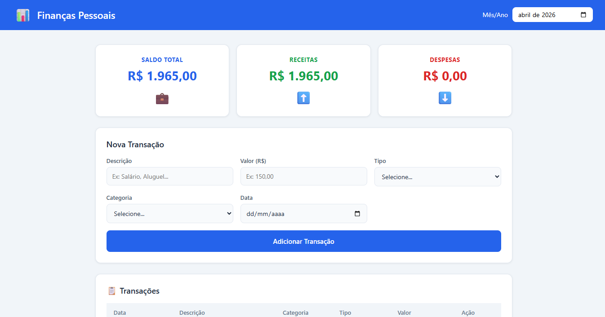

# 💰 Finanças Pessoais

App web fullstack para controle de finanças pessoais, desenvolvido do zero com Node.js, Express e SQLite.

## ✨ Funcionalidades

- Cadastro de receitas e despesas
- Resumo automático de saldo, receitas e despesas totais
- Filtro de transações por mês
- Exclusão de transações
- Interface responsiva e intuitiva

## 🛠 Tecnologias utilizadas

**Backend**
- Node.js
- Express.js
- SQLite (better-sqlite3)
- API REST

**Frontend**
- HTML5
- CSS3 (Flexbox e Grid)
- JavaScript puro (Fetch API)

**Design**
- Figma (protótipo da interface)

## 🚀 Como rodar o projeto

### Pré-requisitos
- Node.js instalado
- Git instalado

### Instalação

\`\`\`bash
# Clone o repositório
git clone https://github.com/Th14g0-s1lv4/financas-pessoais.git

# Entre na pasta
cd financas-pessoais

# Instale as dependências
npm install

# Inicie o servidor
npm start
\`\`\`

Acesse **http://localhost:3000** no navegador.

## 🌐 Deploy

Acesse o app em produção: https://financas-pessoais-production-efb8.up.railway.app

## 📊 Estrutura do banco de dados

\`\`\`sql
CREATE TABLE transacoes (
  id        INTEGER PRIMARY KEY AUTOINCREMENT,
  descricao TEXT    NOT NULL,
  valor     REAL    NOT NULL,
  tipo      TEXT    NOT NULL CHECK(tipo IN ('receita', 'despesa')),
  categoria TEXT    NOT NULL,
  data      TEXT    NOT NULL
)
\`\`\`

## 🔗 Rotas da API

| Método | Rota | Descrição |
|--------|------|-----------|
| GET | /api/transacoes | Lista todas as transações |
| GET | /api/transacoes?mes=2026-04 | Filtra por mês |
| POST | /api/transacoes | Cadastra nova transação |
| DELETE | /api/transacoes/:id | Deleta uma transação |
| GET | /api/resumo | Retorna saldo, receitas e despesas |

## 👨‍💻 Autor

Thiago Silva Farias — www.linkedin.com/in/thiagosilvafarias2003

